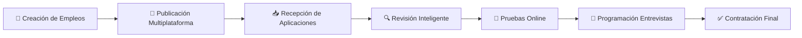
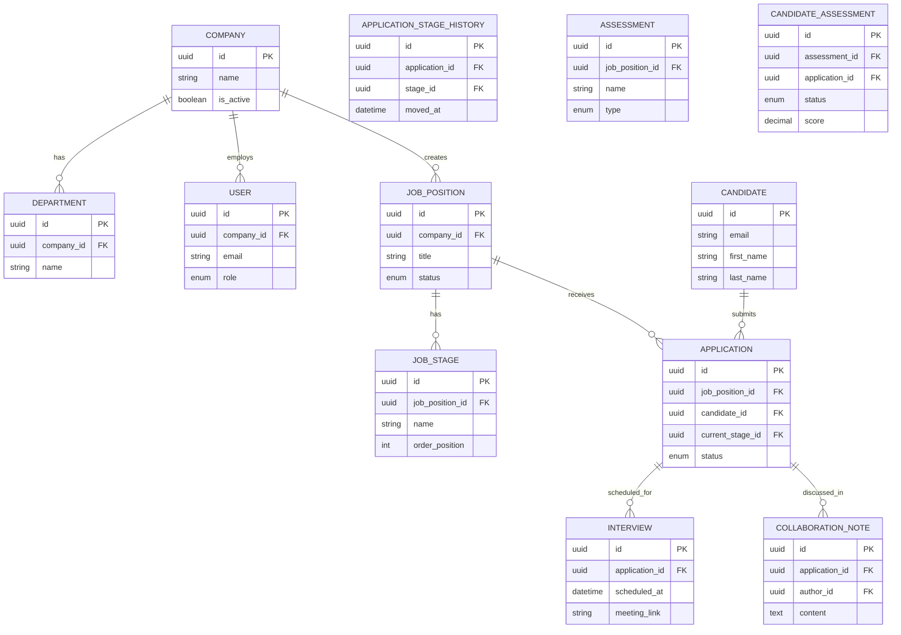
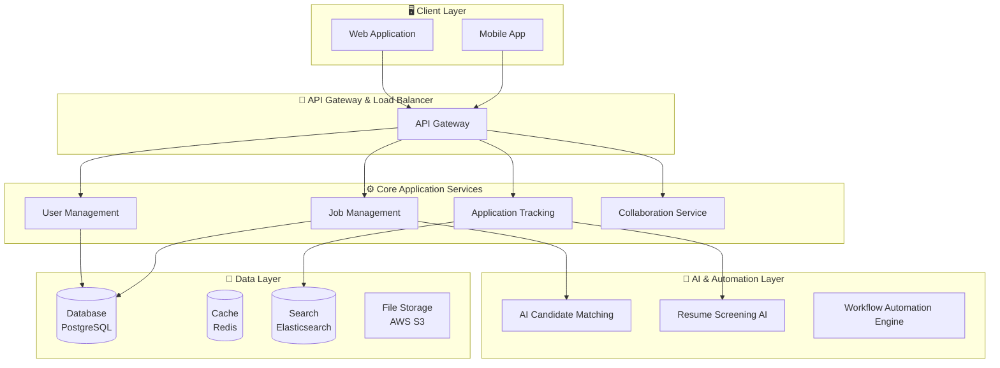

# 🚀 Sistema de Seguimiento de Candidatos (ATS) con IA
## Documentación Completa del Proyecto

---

## 📋 Tabla de Contenidos

- [🎯 Parte 1: Descripción y Diseño del Producto](#-parte-1-descripción-y-diseño-del-producto)
- [📖 Parte 2: Historias de Usuario](#-parte-2-historias-de-usuario)
- [📊 Parte 3: Product Backlog y Priorización](#-parte-3-product-backlog-y-priorización)
- [🔧 Parte 4: Planificación Detallada - HU-01](#-parte-4-planificación-detallada---hu-01)

---

## 🎯 Parte 1: Descripción y Diseño del Producto

### 💡 Descripción del Software ATS - Valor Añadido y Ventajas Competitivas

Nuestro sistema **ATS (Applicant Tracking System)** es una plataforma integral diseñada para **revolucionar la gestión del talento humano** mediante la automatización inteligente y la colaboración en tiempo real. 

#### 🌟 Valor Principal
Transformar un proceso tradicionalmente fragmentado y manual en una **experiencia fluida y basada en datos**.

#### 🏆 Ventajas Competitivas Principales

| Ventaja | Descripción | Impacto |
|---------|-------------|---------|
| 🤖 **IA Integrada** | Análisis predictivo de candidatos | Mejor calidad de contratación |
| 🤝 **Colaboración Real** | Trabajo simultáneo de equipos | Mayor eficiencia |
| ⚡ **Automatización** | Procesos inteligentes | **60% reducción** en tiempo |
| 👥 **UX Dual** | Experiencia optimizada para HR y candidatos | Diferenciación del mercado |

---

### 🔧 Funciones Principales del Sistema

El sistema opera a través de **7 funciones centrales** que siguen el ciclo natural de contratación:

#### Descripción Detallada de Funciones

1. **🎯 Creación de Empleos**
   - Asistencia de IA para optimizar descripciones
   - Definición de requisitos inteligente

2. **📢 Publicación Multiplataforma**
   - Distribución automática en múltiples canales
   - Job boards, redes sociales y sitio web corporativo

3. **📥 Recepción de Aplicaciones**
   - Interfaz unificada centralizada
   - Parsing automático de CVs y scoring inicial

4. **🔍 Revisión Inteligente**
   - Filtros inteligentes y rankings automáticos
   - Machine learning integrado

5. **📝 Pruebas Online**
   - Integración seamless con proveedores externos
   - Tracking interno completo

6. **📅 Programación de Entrevistas**
   - Calendarios inteligentes sincronizados
   - Coordinación automática con stakeholders

7. **✅ Contratación Final**
   - Workflows de onboarding automatizados
   - Generación de documentación legal

---

### 🎨 Lean Canvas

<table>
<tr>
<td colspan="2" style="background-color: #ffebee; padding: 15px;">
<h4>❗ Problema</h4>
<ul>
<li>Procesos de contratación lentos y manuales</li>
<li>Falta de colaboración efectiva</li>
<li>Pérdida de candidatos de calidad</li>
<li>Datos fragmentados y desorganizados</li>
</ul>
</td>
<td style="background-color: #e8f5e8; padding: 15px;">
<h4>🌟 Propuesta Única de Valor</h4>
<strong>El único ATS que combina IA predictiva con colaboración en tiempo real, reduciendo el tiempo de contratación en un 60% y mejorando la calidad de los candidatos.</strong>
</td>
<td colspan="2" style="background-color: #fff3e0; padding: 15px;">
<h4>⚡ Ventaja Injusta</h4>
<ul>
<li>Algoritmos propios de matching</li>
<li>Base de datos de patrones de éxito</li>
<li>Red de integraciones exclusivas</li>
</ul>
</td>
</tr>
<tr>
<td colspan="2" style="background-color: #e3f2fd; padding: 15px;">
<h4>💡 Solución</h4>
<ul>
<li>ATS con IA integrada</li>
<li>Colaboración en tiempo real</li>
<li>Automatizaciones inteligentes</li>
<li>Analytics predictivos</li>
</ul>
</td>
<td rowspan="2" style="background-color: #f3e5f5; padding: 15px; vertical-align: top;">
<h4>📊 Métricas Clave</h4>
<ul>
<li>Time-to-hire</li>
<li>Tasa de conversión</li>
<li>Satisfacción (NPS)</li>
<li>ARR</li>
<li>Retención de clientes</li>
</ul>
</td>
<td colspan="2" style="background-color: #f1f8e9; padding: 15px;">
<h4>👥 Segmentos de Clientes</h4>
<ul>
<li>Empresas medianas (50-500 empleados)</li>
<li>Startups en crecimiento</li>
<li>Agencias de reclutamiento</li>
</ul>
</td>
</tr>
<tr>
<td colspan="2" style="background-color: #fce4ec; padding: 15px;">
<h4>📈 Canales</h4>
<ul>
<li>Ventas directas B2B</li>
<li>Marketing digital</li>
<li>Partners e integradores</li>
<li>Eventos de HR</li>
</ul>
</td>
<td colspan="2" style="background-color: #e0f2f1; padding: 15px;">
<h4>💰 Fuentes de Ingreso</h4>
<ul>
<li>Suscripciones SaaS (varios planes)</li>
<li>Fees de implementación</li>
<li>Servicios de consultoría</li>
<li>Módulos premium</li>
</ul>
</td>
</tr>
<tr>
<td colspan="5" style="background-color: #fff8e1; padding: 15px;">
<h4>💸 Estructura de Costos</h4>
<strong>Desarrollo de software • Infraestructura cloud • Equipo de ventas y marketing • Soporte al cliente • Licencias de IA</strong>
</td>
</tr>
</table>

---

### 🎭 Casos de Uso Principales

#### 📋 Caso de Uso 1: Gestión Completa de Proceso de Contratación

> **Descripción:** Journey completo desde la creación de posición hasta la contratación final

| Elemento | Detalle |
|----------|---------|
| **👤 Actores** | Hiring Manager |
| **🖥️ Sistema** | Sistema ATS |
| **🔄 Flujo** | Crear → Publicar → Filtrar → Entrevistar → Contratar |

#### 🤝 Caso de Uso 2: Colaboración en Tiempo Real

> **Descripción:** Facilitación de colaboración simultánea entre equipos

| Elemento | Detalle |
|----------|---------|
| **👥 Actores** | Reclutador, Hiring Manager, Team Member |
| **🖥️ Sistema** | Hub de Colaboración ATS (WebSocket + Real-time DB) |
| **🔄 Flujo** | Compartir → Calificar → Discutir → Consenso |

#### 🤖 Caso de Uso 3: Automatización Inteligente con IA

> **Descripción:** Capacidades de automatización y análisis predictivo

| Elemento | Detalle |
|----------|---------|
| **👤 Actores** | HR Specialist, Sistema IA |
| **🖥️ Sistema** | Motor de IA y Automatización |
| **🔄 Flujo** | Analizar → Sugerir → Automatizar → Reportar |

---

### 🗄️ Modelo de Datos (Esquema ERD)

---

### 🏗️ Diseño del Sistema a Alto Nivel

---

## 📖 Parte 2: Historias de Usuario

### 🎯 HU-01: Creación de Ofertas de Empleo Asistida por IA
> **Como** Reclutador,  
> **Quiero** utilizar un asistente de IA para que me sugiera y ayude a redactar descripciones de trabajo y requisitos,  
> **Para** optimizar la oferta, atraer candidatos más calificados y reducir el tiempo que dedico a tareas de redacción.

### 🔍 HU-02: Filtrado y Ranking Automático de Candidatos
> **Como** Hiring Manager,  
> **Quiero** que el sistema analice y clasifique automáticamente a los nuevos candidatos que aplican a mi oferta,  
> **Para** poder enfocar mi tiempo de revisión en los perfiles más prometedores y no perder talento valioso.

### 🤝 HU-03: Colaboración en Tiempo Real en el Perfil de un Candidato
> **Como** miembro del equipo de contratación,  
> **Quiero** añadir notas, calificar al candidato y ver los comentarios de mis compañeros en tiempo real,  
> **Para** agilizar la toma de decisiones y centralizar el feedback.

### 📅 HU-04: Programación de Entrevistas con Calendarios Sincronizados
> **Como** Reclutador,  
> **Quiero** ver la disponibilidad combinada de todos los entrevistadores y del candidato en una única vista,  
> **Para** poder programar entrevistas rápidamente.

### 📢 HU-05: Publicación de Ofertas en Múltiples Canales con un Clic
> **Como** Reclutador,  
> **Quiero** publicar una oferta de empleo aprobada en múltiples plataformas (LinkedIn, Indeed) con un solo clic,  
> **Para** maximizar la visibilidad de la oferta y ahorrar tiempo.

---

## 📊 Parte 3: Product Backlog y Priorización

### 1️⃣ Matriz de Eisenhower

<table>
<tr>
<th></th>
<th>🔥 Urgente</th>
<th>⏰ No Urgente</th>
</tr>
<tr>
<td><strong>⭐ Importante</strong></td>
<td style="background-color: #ffcdd2; padding: 10px;">
<strong>✅ Hacer Primero:</strong> 
• HU-01: Creación con IA 
• HU-02: Ranking con IA 
• HU-05: Publicación Multicanal
</td>
<td style="background-color: #fff3e0; padding: 10px;">
<strong>📋 Planificar:</strong> 
• HU-03: Colaboración Real 
• HU-04: Programación Entrevistas
</td>
</tr>
<tr>
<td><strong>➖ No Importante</strong></td>
<td style="background-color: #f3e5f5; padding: 10px;">
<strong>👥 Delegar:</strong> 
(Ninguna)
</td>
<td style="background-color: #e8f5e8; padding: 10px;">
<strong>🗑️ Eliminar:</strong> 
(Ninguna)
</td>
</tr>
</table>

### 2️⃣ Método MoSCoW

| Categoría | Historias de Usuario |
|-----------|---------------------|
| 🔴 **Must-Have** | HU-01, HU-02, HU-05 |
| 🟡 **Should-Have** | HU-03, HU-04 |
| 🟢 **Could-Have** | (Ninguna en esta fase) |
| ⚪ **Won't-Have** | (Ninguna en esta fase) |

### 🏆 Conclusión de Priorización
> **La prioridad máxima es HU-01: Creación de Ofertas de Empleo Asistida por IA**

---

## 🔧 Parte 4: Planificación Detallada - HU-01

### 📋 Desglose en Tickets de Trabajo

| ID Ticket | Título | 👥 Equipo | 📝 Descripción Breve |
|-----------|--------|-----------|---------------------|
| **Ticket-BE-01** | API para CRUD de Ofertas | Backend | Endpoints REST para crear, leer, actualizar y eliminar ofertas |
| **Ticket-BE-02** | Integración con Servicio IA | Backend | Fachada para comunicarse con el motor de IA para obtener sugerencias |
| **Ticket-FE-01** | UI del Formulario de Creación | Frontend | Componente React del wizard de creación de ofertas |
| **Ticket-FE-02** | Lógica de Interacción con IA | Frontend | Lógica para llamar al backend y mostrar las sugerencias de IA al usuario |
| **Ticket-AI-01** | Endpoint de Modelo IA | AI/ML | Exponer endpoint del modelo que genera las sugerencias |
| **Ticket-DO-01** | Despliegue del Servicio de IA | DevOps | Configurar infraestructura y CI/CD para el nuevo microservicio de IA |

---

### 🎯 Decisión de Diseño Clave: ¿Sugerencias en Tiempo Real vs. Botón?

#### 🤔 Análisis con Técnica de los 6 Sombreros

Tras el análisis del equipo, se concluyó:

| 🧠 Aspecto | 📊 Resultado |
|------------|--------------|
| **📈 Hechos** | Latencia del modelo de IA (>1s) y costo asociado problemáticos para tiempo real |
| **⚠️ Riesgos** | Altos costos, mala performance y complejidad técnica elevada |
| **✅ Decisión MVP** | **Botón explícito "Generar Sugerencias con IA"** |

#### 🏆 Justificación de la Decisión

| Ventaja | Descripción |
|---------|-------------|
| 🛡️ **Seguridad** | Mayor control sobre cuándo se ejecuta |
| 💰 **Económica** | Reducción significativa de costos |  
| 🚀 **Rapidez** | Implementación más simple y rápida |
| 👥 **UX Consistente** | Experiencia de usuario predecible |

---

### 📊 Estimación del Esfuerzo

| ID Ticket | 📏 Story Points (SP) | ⏱️ Días-Persona |
|-----------|---------------------|------------------|
| **Ticket-BE-01** | 3 SP | 2 Días |
| **Ticket-BE-02** | 5 SP | 3 Días |
| **Ticket-FE-01** | 5 SP | 3 Días |
| **Ticket-FE-02** | 3 SP | 2 Días |
| **Ticket-AI-01** | 8 SP | 5 Días |
| **Ticket-DO-01** | 5 SP | 3 Días |
| **🎯 Total HU-01** | **29 SP** | **~18 Días-Persona** |

---

## 🎉 Fin de la Documentación

**Sistema ATS con IA - Versión 1.0**

*Documentación creada para guiar el desarrollo del MVP del sistema de seguimiento de candidatos más avanzado del mercado.*

